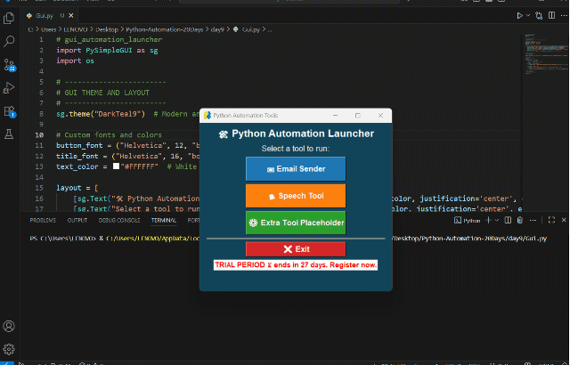

# Python Automation
20-day Python automation journey (file handling, automation scripts, freelancing-ready projects).

## Day 1: File Creation and Organizer
**Scripts:**  
- `creat empty files.py`  
- `organize_files.py`  
- `organizer_dryrun.py`  

**Features:**  
- Creates empty files for testing.  
- Organizes files into folders by type (images, documents, videos, etc.).  
- Includes a dry-run version to preview changes safely.

---

## Day 2: Date-Based Bulk File Renamer
**Script:**  
- `bulk_renamer.py`  

**Features:**  
- Renames files based on last modified date.  
- Adds sequential numbering to prevent collisions.  
- Supports multiple file types.  
- Saves a backup mapping (`name_map.json`) for easy restoration.
## Day 3: File Organizer (Automation Tool)
**Script:**
- `file_organizer.py`

**Features:**
- Scans a folder and organizes files into categories (images, documents, videos, music, others).
- Handles duplicate filenames with smart renaming (no overwrites).
- Easy to customize file categories.
- Provides clear logs for each moved file.
## Day 4: Web Scraper → Save to CSV/Excel
**Script:**
- `WebScraper.py`

**Features:**
- Scrapes quotes, authors, and tags from http://quotes.toscrape.com (or any website via URL change).
- Supports scraping all pages or a custom number of pages or quotes.
- Optionally shows a live progress bar while scraping.
- Saves results into CSV and Excel files (quotes_final.csv / quotes_final_progress.xlsx).
- Includes a small helper to preview the first 10 quotes directly in Python.

## Day 5: PDF Automation Master Script
**Script:**
- `pdf_automation.py`

**Features:**
- Extract Text → Converts PDF content into a .txt file (per page text extraction).
- Merge PDFs → Supports two modes:
    Manual → Select specific PDF files in a custom order.
    Folder → Merge all PDFs inside a folder automatically.
- Extract Tables → Detects tables in a PDF and exports them into an Excel file, with each table saved on a separate sheet.
- Flexible Menu → Choose to run one, two, or all tasks in a single execution.
- Simple & Interactive → User-friendly menu prompts guide you step by step.
Packaged Executable:

- The merging script is also available as a Windows executable (.exe), so no Python installation is needed.
    - Built using PyInstaller, keeping the same PDF libraries as the original script.
    - Ready-to-use: just double-click the .exe to run all features interactively.
### Demo


## Day 6: Images-to-PDF Script 
**Scripts:**
- `images_to_pdf.py`

**Features:**
- Converts images (.jpg, .jpeg, .png) to a single PDF.
- Black watermark (optional) at bottom-right.
- Page numbers added at bottom-center.
- All pages have consistent size (stretch or fit option at runtime).
- Interactive image reorder option at runtime (or default folder order).
- Supports custom output PDF name.

## Day 7: Folder Duplicate Finder & Speech Tools (TTS/STT)

### Script 1: 'duplicate_finder.py'
**Features:**
- Detects duplicate files in a folder and all its subfolders.
- Compares files by **content** using SHA-256 hashing for 100% accuracy.
- Ignores empty files.
- Keeps the **oldest file** as the original, marks newer copies as duplicates.
- User chooses folder to scan (default or custom path).
- Provides 3 actions:
  1. **Report only** – prints duplicates and saves a `duplicates_report.txt`.
  2. **Delete duplicates** – safely deletes newer copies after user confirmation.
  3. **Move duplicates** – moves duplicates to a `duplicates/` folder after confirmation.
- Dry run confirmation before any delete/move action.
- Generates a detailed report listing all duplicates.

### Script 2: 'speech_tools.py'
**Features:**
  - Text-to-Speech (TTS / DTS)

- Convert typed text or text from a file into speech.
- Live playback of audio.
- Optionally save audio as .wav.
- Retry loops for robust input handling.
- Offline functionality (no internet needed).
  - Speech-to-Text (STT / SCT)

- Capture speech via microphone and convert to text using Google Speech Recognition.
- Display recognized text in console.
- Optionally save text as .txt.
- Error handling for unrecognized audio or API issues.
## Day 8: Email Sender (Excel Integration)

**Script:**
- `email_sender.py`

**Features:**
- Send emails in bulk using Gmail SMTP.
- Two sending modes:
    Same message → send one message to all emails.
    Different messages → send a custom message to each email (loaded from Excel).
- Supports file attachments (optional).
- Interactive terminal prompts for easy use and friendly setup instructions for Gmail App Passwords.
- Validates Excel format before sending.

**Excel Format:**
Mode 1 → Same message:
```plaintext
email
person1@gmail.com
person2@gmail.com
```
Mode 2 → Different messages:
```plaintext
email              message
person1@gmail.com  Hello friend1!
person2@gmail.com  Hi friend2!
```
Important: The first row must contain headers (email, and message for mode 2).

**Setup Gmail App Password:**
- Enable 2-Step Verification on your Google Account.
- Go to  App Passwords.
- Select Mail as the app and your device (or “Other”).
- Copy the generated 16-character password.

Use it instead of your normal Gmail password in this script.
## Day 9: GUI Automation Launcher

**Script:**
- 'Gui.py'
  
**Features:**
- Visually Enhanced Launcher → Provides a PySimpleGUI interface to run multiple Python automation scripts from a single window.
- Email Sender → Launches the email_sender.py script in a separate terminal.
- Speech Tool → Launches the speech_tools.py script in a separate terminal.
- Extra Tool Placeholder → Placeholder button for future automation tools, currently shows an interactive popup.
- Compact & Resizable GUI → Modern theme, colored buttons, emojis, and resizable layout.
- Simple & Interactive → User-friendly buttons guide the user step by step without needing command-line input.

### Demo


